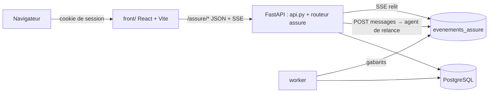
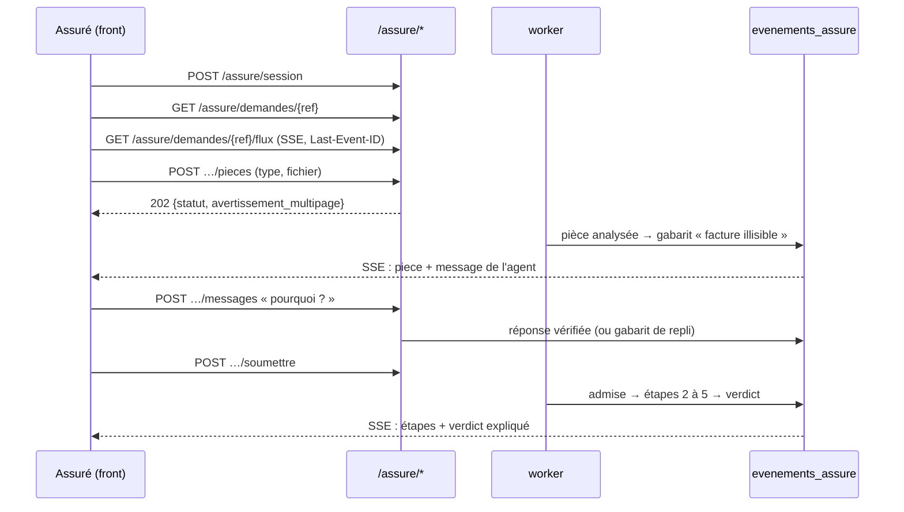

# Interface web : espace sinistre de l'assuré

Spec 1 sur 3 de l'interface web (UI1). Ce document décrit ce qui est **livré** ; la spec de
conception est `docs/superpowers/specs/2026-10-09-ui1-espace-sinistre-design.md`. Les écarts à
cette spec sont consignés dans `docs/journal_ajustements.md`.

## 1. Objet

Un assuré se connecte, dépose ses pièces, est relancé par un agent dans un chat quand une pièce
manque ou est illisible, soumet son dossier et lit un verdict expliqué. Il ne voit jamais rien de
l'anti-fraude, des replis, des traces ni des agents.

- Front : React, Vite, TypeScript, Tailwind, shadcn/ui, dans `front/`. Français seul, mobile d'abord.
- Back : routes `/assure/*` (`api_assure.py`). Les routes de dépôt existantes (`/demandes`,
  `/pieces`, `/soumettre`) et la machine T0–T11 ne changent pas.
- Hors périmètre : la console (specs 2 et 3), le recours, le streaming du LLM jeton par jeton.

## 2. Architecture



Tout ce qui atteint l'assuré passe par `vue_assure.py` (lecture) ou par `evenements_assure`
(flux), **déjà projeté**. Rien d'autre ne sort vers lui.

| Unité (`src/kaldera/`) | Rôle |
|---|---|
| `auth.py` | Comptes (argon2), cookie de session signé, blocage après échecs |
| `vue_assure.py` | Fonctions pures : état interne → étape, branche, pièces, verdict expliqué ; DTO `extra="forbid"` |
| `relance.py` | Agent de relance : outils, garde-fou, gabarits |
| `evenements.py` | `publier_vue()` et `publier_message()` sur `evenements_assure`, au mieux |
| `api_assure.py` | Routeur `/assure/*`, mince : il délègue aux unités ci-dessus |
| `assure_postgres.py` | `DepotAssure` : comptes, rattachement des demandes, événements, lecture de la demande |
| `migrations/004_assure.sql` | `utilisateurs`, `demandes_assure`, `evenements_assure`, `demandes.cree_le`, `pieces.depose_le` |

Le worker et le reaper publient des événements après une analyse, une admission, chaque étape
et la fin de traitement. Ils le font avec des gabarits, sans LLM.

## 3. Parcours



| Méthode | Route | Réponse |
|---|---|---|
| POST / DELETE | `/assure/session` | ouvre ou ferme la session (cookie) |
| GET | `/assure/demandes` | mes sinistres : référence, date, étape |
| GET | `/assure/demandes/{ref}` | `VueDemande` : étape, branche, horodatages, temps restant, pièces, verdict |
| POST | `/assure/demandes/{ref}/pieces` | dépôt (mêmes contrôles que l'existant) ; `avertissement_multipage` si le PDF a plusieurs pages ; 415 format, 413 taille, 409 après soumission |
| POST | `/assure/demandes/{ref}/soumettre` | admission ; 409 `analyse_en_cours`, `confirmation_requise` (pièces manquantes, `confirmer=true` exigé), `deja_soumise` |
| POST | `/assure/demandes/{ref}/messages` | message (1 à 1 000 caractères, 30 au plus par demande, sinon 429) → réponse de l'agent ; 409 `dossier_clos` après le verdict |
| GET | `/assure/demandes/{ref}/flux` | SSE : événements `etape`, `piece`, `message`, `verdict` ; reprise avec `Last-Event-ID` |

Le flux relit `evenements_assure` une fois par seconde (`run_in_threadpool`, psycopg est
synchrone) et se termine au verdict. L'historique du chat est le même flux relu depuis 0 : les
messages sont des événements `message`, il n'y a pas de table `messages_assure`. Le chat s'arrête
donc au verdict : la page ne le propose plus, et la route des messages répond 409 `dossier_clos`
(demande `terminee` ou `secours`), avant tout appel au LLM. Le flux s'arrête aussi quand le
navigateur se déconnecte.

## 4. Correspondance entre phases internes et étapes affichées

La correspondance porte sur des **phases**, pas sur des états. Elle est calculée côté serveur.

| Étape (assuré) | Phase interne |
|---|---|
| 1. Demande reçue | dépôt et analyse des fichiers (worker, VLM) jusqu'à l'admission |
| ↳ En attente de vos pièces | une pièce attendue manque, ou un fichier est illisible ou du mauvais type, **avant l'admission** |
| 2. Vérification de votre dossier | éligibilité, garde T0, pièces |
| 3. Évaluation du dommage | estimation |
| 4. Contrôles complémentaires | anti-fraude (libellé neutre, rien d'autre affiché) |
| 5. Décision | issue : acceptée, partielle ou refusée |
| ↳ Transmise à un gestionnaire | escalade vers `gestionnaire` **ou vers `cellule_fraude`**, règle 0, secours du reaper |

Pour une demande en cours de traitement, `ETAPES_EN_COURS` (`vue_assure.py`) donne l'étape :

| Phase interne en cours | Étape affichée |
|---|---|
| `eligibilite` | 2 |
| `pieces` | 2 |
| `estimation` | 3 |
| `antifraude` | 4 |
| `decision` | 5 |
| tout autre état en cours | 5 |

Une demande en `admission` est à l'étape 1 (branche « en attente de vos pièces » si rien n'est en
analyse, que le dossier n'est pas soumis et qu'une pièce est à fournir ou à refaire). Une demande
terminée par une décision est à l'étape 5. Toute autre fin (escalade de toute file, secours du
reaper) est à l'étape 5, branche « Transmise à un gestionnaire ».

## 5. Règles de confidentialité

1. Une escalade vers `cellule_fraude` donne une vue **identique** à une escalade vers `gestionnaire`
   (même libellé, même texte).
2. Le mode dégradé, les replis, les traces, les noms d'agents, l'avis anti-fraude, le score, les
   indicateurs et les états internes ne sont jamais exposés.
3. Le navigateur reçoit le numéro de l'étape et le nom de la branche, jamais l'état interne.

Mise en œuvre :

- `VueDemande`, `MessageChat` et chaque DTO sont des modèles `extra="forbid"` : un champ non prévu
  fait échouer la projection au lieu de fuir.
- Le motif brut de la fiche n'est **jamais** recopié (il contient parfois « fraude », même sur la
  file `gestionnaire`). Le verdict expliqué vient de textes écrits à la main (`CONDITIONS_EN_CLAIR`) ;
  un motif hors du tableau reçoit un texte neutre.
- Les événements contiennent une vue déjà projetée : `etape`, `piece` et `verdict` portent la
  `VueDemande` complète, `message` porte un `MessageChat`.

**Tests** : `tests/unit/test_confidentialite_assure.py` rejoue les 28 scénarios de
`eval/scenarios.jsonl`, avec quatre avis possibles du partenaire (dont l'indisponibilité), et vérifie
que la vue construite pour l'assuré ne contient aucun terme interdit (fraude, cellule, dégradé, repli,
score, indicateur, partenaire, trace, nom d'agent, état interne…) ; une escalade, quelle que soit sa
file, donne le même texte. `tests/unit/test_vue_assure.py` (`test_liste_blanche`) vérifie le refus
d'un champ non prévu ; le parcours Playwright revérifie les mots interdits dans la page, après le chat.

## 6. Agent de relance

**Rôle** : expliquer quelles pièces manquent et pourquoi, et répondre aux questions **sur les pièces
seulement**. Il ne soumet rien, ne dépose rien et ne promet rien.

- **Outils** (liste fermée, mécanique d'`AgentLLM`) :
  - `reference_relance` : intention de la question et pièces concernées, calculées par le code ; elle fait foi ;
  - `liste_pieces` : pièces attendues et statut (les raisons de rejet y figurent) ;
  - `consigne_depot` : comment déposer une pièce.
- **Entrée** : la question de l'assuré est une donnée non fiable, placée entre balises
  `<donnees_non_fiables>`. Les chevrons `<` et `>` y sont neutralisés, pour qu'elle ne puisse pas
  fermer la balise.
- **Garde-fou de sortie** (`controle_relance`) : texte non vide, 600 caractères au plus, aucune
  pièce citée hors de la liste calculée, et aucun terme interdit. La liste interdite couvre :
  - l'anti-fraude et le partenaire ;
  - l'argent : montant, euros, remboursement, indemnisation, virement, paiement ;
  - la décision : acceptation, refus, approbation, couverture, prise en charge ;
  - l'état interne : estimation, escalade, cellule, mode dégradé, agent, repli.
- **Gabarits** : si le garde-fou échoue, si le délai du profil est dépassé ou s'il n'y a pas de
  profil, le gabarit de l'intention détectée par le code répond (`liste` des pièces,
  `rejet` d'une pièce illisible, `conseiller` pour toute autre question). Le repli n'est jamais signalé.
- **Messages spontanés** : gabarits publiés par le worker après une analyse (pièce à refaire) ou quand
  la liste devient complète. Aucun appel au LLM dans ce chemin.
- **Profil** : `KALDERA_RELANCE__MODELE`, `DELAI_AGENT_S`, `JETONS_MAX`, `TOURS_MAX`.

## 7. Sécurité de la session

- Cookie `kaldera_session` signé (itsdangerous), `httpOnly`, `SameSite=Strict`, `Secure` sauf si
  `KALDERA_COOKIE_SECURE=false` (local en http seulement), durée de 8 h.
- **Secret** `KALDERA_SESSION_SECRET` : le routeur est toujours monté, mais sans secret chaque route
  `/assure/*` répond 503 « espace assuré non configuré », et l'API l'indique au démarrage. Un secret
  vide ou fait d'espaces vaut absent : il n'existe jamais de clé de signature vide.
- **Origine** : toute requête de modification dont l'en-tête `Origin` diffère de
  `KALDERA_FRONT_ORIGIN` (défaut `http://localhost:5173`) répond 403.
- **Connexion** : mot de passe haché avec argon2. 5 échecs ⇒ compte bloqué 5 minutes. La réponse
  (401) est identique quelle que soit la cause : identifiant inconnu, mauvais mot de passe, compte
  bloqué. Un compte inconnu ou bloqué paie un hachage factice, pour qu'aucune différence de temps ne
  révèle l'existence d'un compte ou son blocage.
- **Appartenance** : une demande d'un autre assuré répond **404**, jamais 403.
- **Limite connue** : les jetons sont sans état. La déconnexion et un changement de mot de passe
  n'invalident pas un jeton déjà émis, qui reste valable jusqu'à son expiration (8 h).
- **Événements au mieux** : une publication en échec est journalisée et ignorée. Elle ne change
  jamais l'issue d'une demande (la base ne bloque jamais une décision) ; un événement manqué se
  rattrape au rechargement de la page. Les événements des étapes 3 et 4 sont émis après le
  traitement : leurs horodatages sont séparés de quelques millisecondes.
- **Flux côté navigateur** : `useFluxDemande` rouvre le flux après une coupure ou une erreur HTTP
  (rejeu depuis 0, idempotent), mais une sonde signale une session expirée (401) ou une demande
  inconnue (404) au lieu de réessayer sans fin ; tout 401 renvoie vers `/connexion`.
- **Panne au chargement** (503, réseau) : seuls 401 et 404 sont définitifs. Toute autre erreur
  affiche le bandeau « service momentanément indisponible, vos fichiers n'ont pas été perdus » et
  la vue est relue toutes les 3 s jusqu'au retour du service (spec §6). « Mes sinistres » propose
  « Réessayer » ; la connexion distingue le mot de passe refusé (401) du service indisponible.

## 8. Lancer en local

Variables (voir `.env.example`) : `KALDERA_DATABASE_URL`, `KALDERA_SESSION_SECRET` (à renseigner,
sinon 503) et `KALDERA_COOKIE_SECURE=false` (http local).

```bash
make up
docker compose --profile integration up -d --wait postgres
make demo-assure
make api
make worker
make front
```

`make demo-assure` crée la demande `KAL-26-0101` (scénario NOM-01, à partir des fixtures de
`make generer`) et le compte `claire`. Le mot de passe de démonstration est lu dans
`KALDERA_DEMO_MOT_DE_PASSE` ; il ne sert jamais pour un vrai compte. Le front sert sur
`http://localhost:5173` et proxifie `/assure` vers `:8000`.

## 9. Tests

- `make front-test` : Vitest et Testing Library, avec `axe` (stepper, pièces, dépôt, chat, verdict,
  page pilotée par un faux flux SSE).
- `make front-e2e` : Playwright, un parcours complet (connexion, facture illisible, message
  spontané, question dans le chat, nouveau dépôt, soumission, verdict) contre l'API réelle et un
  worker sur `FakeVLM`, partenaire indisponible, sans appel Azure. Le serveur
  (`tests/e2e/serveur.py`) vide la base de test et **refuse de démarrer sans `TEST_DATABASE_URL`**.
  Le parcours complet tourne en mobile ; le desktop est ignoré (une seule base de test).
- Back-end : `make test` (unitaires, dont la confidentialité) et `make test-integration`
  (PostgreSQL : 401, 404, `Origin`, dépôt, soumission, SSE, événements du worker).
