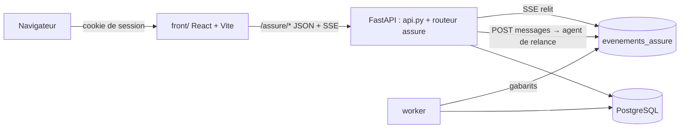
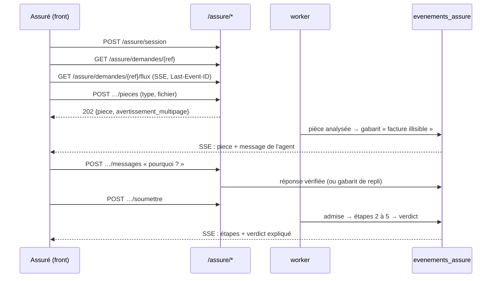
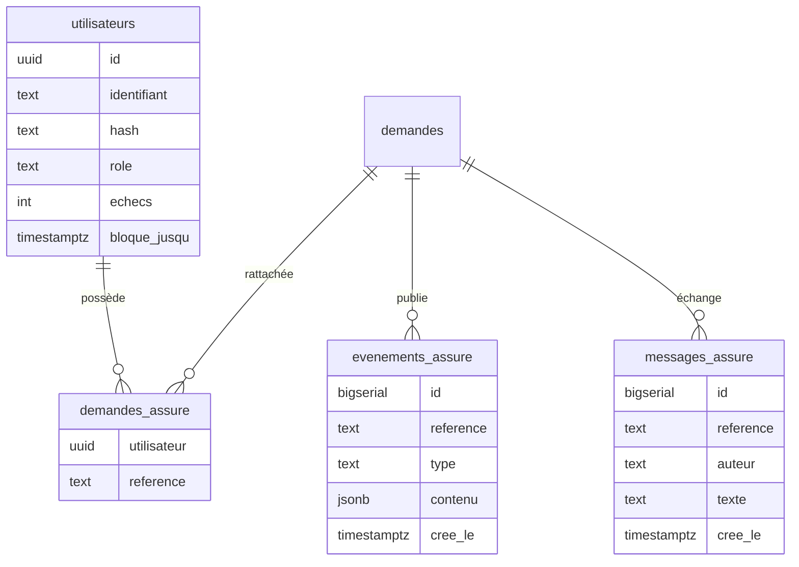

# UI1 · Socle web, espace sinistre et agent de relance — design

> Brief : `prompt-ui.md` (racine du dossier kaldera-agents). Spec 1 sur 3 de l'interface web.
> Brainstorming mené à partir du graphe graphify seulement (§0.1 du brief) ; sources en fin de document.

## 1. Objet et périmètre

Livrer le **socle web** (front, authentification, projection vers l'assuré, flux temps réel) et la
**page Espace sinistre** complète, **agent de relance compris**.

Critère de réussite : en local, un assuré se connecte, dépose ses pièces, est relancé par l'agent
dans le chat quand une pièce manque ou est illisible, soumet son dossier et lit un verdict expliqué.
Il ne voit jamais rien de l'anti-fraude, des replis ni des traces des agents.

Découpage de l'interface web :

| Spec | Contenu |
|---|---|
| **1 (ce document)** | Socle (UI0) + espace sinistre (UI1) + agent de relance (UI4) |
| 2 | Console : configuration (A4–A8 : secrets chiffrés, configuration rechargeable, partenaire) |
| 3 | Console : données et supervision (A1–A3, A9–A13) |

Dans cette spec, la demande et son contrat sont créés par un script de démonstration
(`make demo-assure`), à partir des fixtures `make generer`. La console de la spec 3 reprendra ce rôle.

### Fonctionnalités retenues (MoSCoW)

| # | Fonctionnalité | Priorité |
|---|---|---|
| C1 | Dépôt des pièces (glisser-déposer, photo mobile, aperçu, avertissement PDF multipage) | Must |
| C2 | Chat avec l'agent de relance | Must |
| C3 | Temps : temps écoulé et temps restant estimé (**pas de délai contractuel**) | Must |
| C4 | Stepper des étapes métier | Must |
| C5 | Verdict | Must |
| C6 | Liste des pièces attendues, avec un statut par pièce | Must |
| C8 | Explication du verdict | Must |
| C16 | Accessibilité WCAG AA / RGAA, mobile d'abord | Must |
| C11 | Journal d'activité, sous la forme des horodatages du stepper | Should |
| C14 | Liste de mes sinistres (le résumé du contrat est en Could) | Should |
| C7, C9 | Champs lus par le VLM ; recours | Could (hors de cette spec) |
| C10, C12, C13, C15 | Rappel par un conseiller, notifications, indemnisation, enquête | Won't (ici) |

### Décisions prises au brainstorming

| Sujet | Décision |
|---|---|
| Stack front | React + Vite + TypeScript + Tailwind + shadcn/ui, dans `front/` |
| Authentification | Session simple prévue pour être remplacée (comptes en base, argon2, cookie signé) ; OIDC plus tard, sans toucher aux routes |
| Routes | Nouvelles routes `/assure/*` authentifiées ; les routes de dépôt existantes ne changent pas (seed, épreuve) |
| Étapes | 5 étapes et 2 branches, calculées côté serveur (§3) |
| Relance | **Avant l'admission** : la machine T0–T11 et la borne de 10 s ne changent pas, et il n'y a pas d'état d'attente |
| Agent de relance | Borné aux pièces : le code calcule les faits, le LLM les formule, le garde-fou vérifie, sinon un gabarit prend le relais |
| Temps réel | Table `evenements_assure`, déjà projetée, relue par la route SSE ; messages spontanés par gabarit ; réponses du LLM livrées en une fois, après vérification |
| Langue, cible | Français seul (textes dans un seul fichier) ; mobile d'abord |

## 2. Architecture

**Principe de confidentialité structurant** : tout ce qui atteint l'assuré passe par `vue_assure.py`
(lecture) ou par `evenements_assure` (flux), **déjà projeté**. Rien d'autre ne sort vers lui.

### Unités back-end (`src/kaldera/`)

| Unité | Rôle | Dépend de |
|---|---|---|
| `auth.py` | Comptes (argon2), cookie de session signé, dépendance `utilisateur_courant()`, contrôle d'appartenance d'une demande | `utilisateurs`, `demandes_assure` |
| `vue_assure.py` | Fonctions pures : état interne → étape et branche, liste des pièces, verdict expliqué ; DTO pydantic `extra="forbid"` (liste blanche) | `regles.py`, descripteurs des pièces |
| `relance.py` | Agent de relance : outils, garde-fou propre, gabarits de repli, messages spontanés | `AgentLLM`, `gardes_fous`, profil `KALDERA_RELANCE__*` |
| `evenements.py` | `publier()` et `lire_depuis(id)` sur `evenements_assure` ; écrit un contenu déjà projeté | PostgreSQL |
| `api_assure.py` | Routeur `/assure/*` minimal : il délègue aux unités ci-dessus et réutilise `controler_fichier` et `IngestionPostgres` | — |
| `migrations/004_assure.sql` | Tables `utilisateurs`, `demandes_assure`, `evenements_assure`, `messages_assure` | — |

Le worker n'a qu'une modification : il appelle `evenements.publier()` après une analyse, une
admission et une fin de traitement. Il le fait avec un gabarit, sans LLM.

### Front (`front/`)

- Vite + React + TypeScript + Tailwind + shadcn/ui, avec un proxy de dev vers `:8000`.
- Pages : `Connexion`, `MesSinistres`, `Sinistre`.
- Un seul hook `useFluxDemande`, branché sur `EventSource`, porte tout l'état de la page `Sinistre`.
- Libellés regroupés dans `front/src/textes.ts`.

## 3. Étapes visibles par l'assuré

La correspondance porte sur des **phases** internes, pas sur des états. Elle sera vérifiée ligne à
ligne contre `machine.py` dans le plan (voir §11, « absent du graphe »).

| Étape (assuré) | Phase interne |
|---|---|
| 1. Demande reçue | dépôt et analyse des fichiers (worker, VLM) jusqu'à l'admission |
| ↳ En attente de vos pièces | une pièce attendue manque, ou un fichier est illisible ou du mauvais type, **avant l'admission** |
| 2. Vérification de votre dossier | éligibilité, garde T0, pièces |
| 3. Évaluation du dommage | estimation |
| 4. Contrôles complémentaires | anti-fraude (libellé neutre, rien d'autre affiché) |
| 5. Décision | issue : acceptée, partielle ou refusée |
| ↳ Transmise à un gestionnaire | escalade vers `gestionnaire` **ou vers `cellule_fraude`**, règle 0, secours du reaper |

Écart assumé avec le brief : la branche « En attente de vos pièces » se rattache à l'étape 1 et non
à l'étape 2, conséquence directe d'une relance placée avant l'admission.

Règles de confidentialité :

1. Une escalade vers `cellule_fraude` donne une vue **identique** à une escalade vers `gestionnaire` (libellé, texte).
2. Le mode dégradé, les replis, les traces, les noms d'agents et les états internes ne sont jamais exposés.
3. Le navigateur reçoit le numéro de l'étape et le nom de la branche, jamais l'état interne.

## 4. Parcours et routes

Toutes les routes exigent une session `assure` et vérifient que la demande appartient à l'assuré
connecté. Sinon, elles répondent **404** (jamais 403), pour ne pas révéler qu'une référence existe.

| Méthode | Route | Réponse |
|---|---|---|
| POST / DELETE | `/assure/session` | ouvre ou ferme la session (cookie) |
| GET | `/assure/demandes` | mes sinistres : référence, date, étape |
| GET | `/assure/demandes/{ref}` | `VueDemande` : étape et branche, horodatages, temps, liste des pièces, verdict expliqué |
| POST | `/assure/demandes/{ref}/pieces` | dépôt avec les mêmes contrôles que l'existant, plus `avertissement_multipage` (nombre de pages lu par pypdf) |
| POST | `/assure/demandes/{ref}/soumettre` | admission ; **409** tant qu'une pièce est en cours d'analyse ; `confirmer=true` exigé si des pièces manquent |
| POST | `/assure/demandes/{ref}/messages` | message (1 à 1 000 caractères) → réponse de l'agent |
| GET | `/assure/demandes/{ref}/flux` | SSE ; événements `etape`, `piece`, `message`, `verdict` |

- L'assuré dépose **uniquement des pièces** (facture, photo, récépissé de plainte), jamais le contrat.
- **Temps (C3)** :
  - temps écoulé depuis la création de la demande ;
  - temps restant estimé selon la phase : `delai_analyse_s` par fichier en cours d'analyse, puis 10 s maximum après l'admission.
- La route SSE est une fonction `async`. Elle relit la table une fois par seconde par `run_in_threadpool`, puisque psycopg est utilisé en synchrone, et commence après le `Last-Event-ID` reçu.

## 5. Agent de relance

**Rôle.** Expliquer quelles pièces manquent et pourquoi, et répondre aux questions **sur les pièces
seulement**. Il ne soumet rien, ne dépose rien et ne promet rien.

- **Messages spontanés** :
  - **gabarits déterministes** publiés par le worker à la fin d'une analyse (pièce illisible, mauvais type, montant absent) et quand la liste devient complète ;
  - aucun appel au LLM dans ce chemin.
- **Réponses** : `POST …/messages` exécute l'agent de relance dans le délai de son profil. La réponse vérifiée est enregistrée dans `messages_assure`, puis publiée comme événement `message`.
- **Mécanique** : celle d'`AgentLLM`.
  - D'abord une **référence déterministe** : la liste des pièces et leur état, calculés par `vue_assure`.
  - Ensuite une boucle bornée, avec trois outils autorisés : `liste_pieces`, `etat_fichier`, `consigne_depot`.
  - 5ᵉ profil dans le `.env` : `KALDERA_RELANCE__MODELE`, `DELAI_AGENT_S`, `JETONS_MAX` et `TOURS_MAX`.
- **Entrée** : le message de l'assuré, toujours placé entre balises `<donnees_non_fiables>`.
- **Garde-fou de sortie** :
  1. `donnees_sensibles()` ;
  2. une liste de termes interdits : fraude, partenaire, score, repli, montant promis, décision anticipée ;
  3. toute pièce citée appartient à la liste calculée ;
  4. une longueur maximale.
- **Repli** : un échec du garde-fou, un délai dépassé ou l'absence de profil donnent le **gabarit** correspondant à l'intention détectée par le code (liste des pièces, raison du rejet, orientation vers un conseiller). Le repli n'est jamais signalé à l'assuré.

## 6. Confidentialité, sécurité, erreurs

**Confidentialité**
- `VueDemande` et chaque type d'événement sont des modèles `extra="forbid"`.
- **Verdict expliqué (C8)** : issue, montant, franchise, et motif tiré d'un **tableau de correspondance** entre motifs types et textes pour l'assuré, écrit à la main.
  - Le motif brut de la fiche n'est jamais recopié.
  - Un motif hors du tableau reçoit un texte neutre générique.

**Session**
- Cookie signé `httpOnly`, `Secure` hors dev, `SameSite=Strict`, d'une durée de 8 h.
- Secret lu dans `KALDERA_SESSION_SECRET` : sans lui, le routeur `/assure` n'est pas monté et l'application l'indique au démarrage.
- `POST` refusé si l'en-tête `Origin` diffère de `KALDERA_FRONT_ORIGIN`.
- Connexion : 5 échecs par compte ⇒ blocage de 5 minutes, avec un message identique quelle que soit la cause.

**Erreurs**

| Cas | Ce que voit l'assuré |
|---|---|
| Base indisponible (503, handler existant) | bandeau « service momentanément indisponible, vos fichiers n'ont pas été perdus » ; le front réessaie |
| Fichier refusé (415, 413) ou doublon (200) | message propre au cas, à côté de la zone de dépôt |
| Coupure du flux SSE | reconnexion automatique avec `Last-Event-ID`, sans perte ni doublon |
| Agent LLM en échec | gabarit, sans message d'erreur |
| Demande reprise par le reaper (`secours`) | étape « Transmise à un gestionnaire » |
| Soumission avec des pièces manquantes | confirmation explicite ; le moteur escalade ensuite comme aujourd'hui |

## 7. Interface

- **Design system** : à générer avec ui-ux-pro-max après validation de cette spec et avant le plan (brief §0, étape 2).
  - Résultat versionné dans `design-system/kaldera/MASTER.md` (arborescence imposée par l'outil), avec la variante `design-system/kaldera/pages/espace-sinistre.md`.
  - Palette vert foncé et or ; l'or sert aux accents, **jamais au texte courant** (contraste AA).
- **Page `Sinistre`** :

| Zone | Points clés |
|---|---|
| Bandeau de statut (C3) | étape en clair, temps écoulé, temps restant estimé (anneau) ; `aria-live="polite"` |
| Stepper (C4, C11) | liste ordonnée `<ol>` verticale, branches insérées, horodatages ; étape courante signalée par `aria-current="step"` |
| Liste des pièces (C6) | à fournir, en analyse, validée, à refaire (raison) ; statut écrit en toutes lettres, avec une icône |
| Dépôt (C1) | glisser-déposer et `<input type="file" accept="image/*,application/pdf" capture="environment">` ; aperçu ; avertissement multipage ; dépôt possible au clavier |
| Soumettre | actif quand plus rien n'est en analyse ; demande une confirmation si des pièces manquent |
| Verdict (C5, C8) | issue, montant, franchise, explication, pièces retenues |
| Chat (C2) | panneau repliable sur desktop, plein écran sur mobile ; `role="log"` ; boutons d'action rapide |

- **Disposition** :
  - en dessous de 1024 px, tout est empilé : statut, liste des pièces, dépôt, stepper, verdict, avec le chat en bouton flottant ;
  - à partir de 1024 px, le wireframe §2.4 du brief.
- **Accessibilité** :
  - AA vérifié par les tests ;
  - clavier, focus visible ;
  - erreurs reliées à leur champ par `aria-describedby` ;
  - `prefers-reduced-motion` respecté ;
  - cibles tactiles d'au moins 44 px.

## 8. Données

- `role` ∈ {`assure`, `admin`}.
- `evenements_assure.type` ∈ {`etape`, `piece`, `message`, `verdict`}.
- `messages_assure.auteur` ∈ {`assure`, `agent`}.
- Le contenu d'un événement est le DTO projeté, sérialisé.

## 9. Tests

**Back-end (pytest, TDD)**

| Niveau | Contenu |
|---|---|
| Unitaires | <ul><li>`vue_assure` : phase → étape pour chaque état ; `cellule_fraude` ≡ `gestionnaire` ; motif inconnu → texte neutre</li><li>`relance` : chaque contrôle du garde-fou, avec les saboteurs `FakeLLM`, et un repli par cas</li><li>`auth` : argon2, cookie (signature, expiration), blocage, refus sans secret</li></ul> |
| **Confidentialité** | <ul><li>les 28 scénarios de `eval/scenarios.jsonl` : ni la vue ni les événements ne contiennent `avis_fraude`, score, indicateurs, `cellule_fraude`, `mode_degrade`, repli, trace, nom d'agent ou état interne</li><li>un test sur la liste blanche de chaque DTO</li></ul> |
| Intégration (PostgreSQL) | <ul><li>401 sans session ; 404 sur la demande d'un autre assuré ; `Origin` refusée</li><li>dépôt et avertissement multipage ; soumission (409, `confirmer`)</li><li>SSE : ordre des événements, reprise avec `Last-Event-ID`</li><li>le worker publie ses événements</li></ul> |

**Front**
- Vitest et Testing Library, avec `axe` : stepper, liste des pièces, dépôt et avertissement, chat, verdict, page pilotée par un faux flux SSE.
- **Playwright**, un parcours complet :
  1. connexion ;
  2. facture illisible ;
  3. message spontané ;
  4. question posée dans le chat ;
  5. nouveau dépôt ;
  6. soumission ;
  7. verdict.

  Il tourne contre l'API réelle et un worker de test sur `FakeVLM` et `FakeLLM`, avec le partenaire indisponible. Aucun appel Azure.

**Non-régression**
- `make test`, `make lint` et `make typecheck` restent verts.
- Les 14 tests A2A en échec ne sont pas touchés.
- `make test-integration` reste vert.

## 10. Livrables

- Code : `src/kaldera/{auth,vue_assure,relance,evenements,api_assure}.py`, `migrations/004_assure.sql`, `front/`.
- `make front` (dev Vite), `make front-test` (Vitest), `make front-e2e` (Playwright), `make demo-assure`.
- Nouvelles dépendances :
  - back-end : `argon2-cffi`, `itsdangerous` ;
  - front : `package.json` dans `front/`.
- `.env.example` : `KALDERA_SESSION_SECRET`, `KALDERA_FRONT_ORIGIN`, `KALDERA_RELANCE__*`.
- `design-system/kaldera/MASTER.md` et `design-system/kaldera/pages/espace-sinistre.md` (générés et adaptés ; `console-admin.md` brut, revu en spec 2).
- Documentation `docs/interface_web.md`, en français, avec schémas Mermaid ; README (Setup, Utilisation, Layout) ; une ligne au journal des ajustements.
- Travail dans le worktree `.claude/worktrees/ui-assure`, sur la branche `feature/ui-espace-sinistre`.

### Hors périmètre

- La console (specs 2 et 3) : secrets, configuration rechargeable, partenaire, génération, supervision.
- C7, C9, C10, C12, C13 et C15.
- Le streaming du LLM jeton par jeton.
- La lecture multipage par le VLM (seulement l'avertissement).
- Le chantier 2 (A2A strict, disjoncteur, `make eval`).

## 11. Sources graphify

Graphe du 09/10/2026 (1521 nœuds). Le README réécrit et `prompt-ui.md` ne sont **pas** dans le
graphe : la mise à jour incrémentale a été refusée par le mode automatique. Aucun secret n'a été
trouvé dans `graph.json`.

| Affirmation | Nœud (fichier) |
|---|---|
| API de dépôt aux routes minces | « API de dépôt (dossier 2.4 ter) : routes minces… » (`api.py` L1), `Depot` (`api.py` L74), « FastAPI deposit API (sync def routes) » (plan SP3a) |
| Admission à la soumission | `soumettre()` (`api.py` L126), `.soumettre()` et `.admissibles()` (`ingestion_postgres.py` L101, L278) |
| Dépôt d'ingestion | `IngestionPostgres` (`ingestion_postgres.py` L41) |
| Machine à états, seule source de vérité | `machine.py` L1, `Etat` (L16), `garde_entree()` (L79), « Table de transitions T0-T11 » (dossier p14) |
| Familles de transitions | `test_transitions_des_pieces`, `…_de_la_decision`, `…_de_l_estimation` (`test_machine.py`) |
| Seule boucle : la relance | `test_la_seule_boucle_est_la_relance_des_pieces` (`test_machine.py` L38), « Machine a etats finis » (dossier p11) |
| Relance simulée et bornée | « lit le dépôt n°k à la relance n°k » (`agents.py` L53), `depot_pour()` (`espace_assure.py` L13), « Niveau 0 : `pieces` et `espace_assure.depots` » (`memoire.py` L15), `test_relance_bornee_signale_l_arret` |
| État d'attente jugé illégal | « Smell: etat illegal en_attente » (`docs/ddd/domain-map.md`) |
| Pièces manquantes | `AgentPieces` (`agents.py` L52), `_manquantes()` (L83) |
| Seul écrivain de l'issue | « Seul écrivain de l'issue… » (`agents.py` L170), « Agent decision » (dossier p4) |
| Files humaines | « Files humaines gestionnaire / cellule_fraude » (`specs_metier.md`) |
| 10 s, admission comme t = 0 | « Engagements de service (10 s…) » (`specs_metier.md`), « Contrôle d'admission » (dossier) |
| Mécanique des agents LLM | `AgentLLM` (`._reference()`, `._boucle()`), `OutilRefuse`, `_gabarit_pieces()` (`agents_llm.py`), `verifier_sortie()` et `donnees_sensibles()` (`gardes_fous.py`), « Balises donnees_non_fiables (anti-injection) », « Configuration LLM par agent dans le .env » |
| Configuration | `pydantic_settings`, `ConfigLLM` (`llm.py` L135), `ConfigIngestion` |
| Un appel partenaire par dossier | « Un seul appel par dossier, aucune relance » (`external_agent/contrat.md` p31) |

**Absent du graphe** (signalé pendant le brainstorming) :
- les valeurs de l'énumération `Etat` et le détail ligne à ligne de T0–T11 ;
- tout agent conversationnel ;
- toute authentification ou notion de rôle ;
- tout mécanisme SSE ou de diffusion ;
- un délai contractuel côté assuré (retiré de C3) ;
- une langue ou une cible d'appareil ;
- tout code front.

Les deux premiers points seront vérifiés dans le code au moment du plan.
